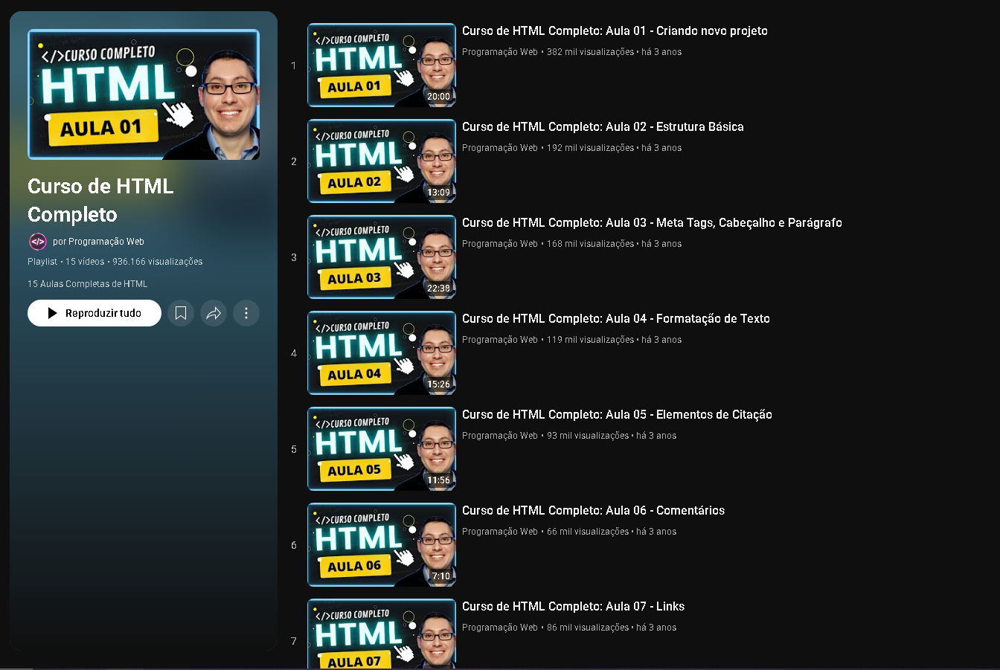

# 📙 Curso de HTML - Programação Web

Este repositório reúne exercícios e projetos de **HTML**, com o objetivo de documentar o aprendizado dos principais conceitos, organizados em pastas que representam os temas estudados.  

Em **2023**, entrei em um projeto de extensão na Anhembi Morumbi sem saber nada sobre desenvolvimento web. Foi então que encontrei este curso no YouTube e me surpreendi com o quanto consegui aprender em tão pouco tempo. Foram horas de dedicação que me proporcionaram uma base muito sólida em HTML.  

##  Referência de estudo

Durante meus estudos, utilizei a seguinte playlist do YouTube como base:

- [Curso HTML Completo ](https://www.youtube.com/playlist?list=PL2Fdisxwzt_cajoGVWTx44wM6Ht09QJ3A)

  

## 🔹 Conteúdo  

- **site1** – Estrutura básica de HTML: criação de páginas com `<html>`, `<head>`, `<body>`, títulos, parágrafos e listas.  
- **site2** – Primeiros links e navegação: aprendizado sobre `<a>` e navegação entre páginas.  
- **site3** – Elementos de texto: formatação de parágrafos, negrito, itálico e listas ordenadas e não ordenadas.  
- **site4** – Estrutura de páginas múltiplas: prática de páginas navegáveis e organização de conteúdo em diferentes arquivos.  
- **site5** – Organização e páginas institucionais: criação de páginas como **equipe** e **sobre**, com estrutura de site mais completa.  
- **site6** – Imagens: inserção de imagens usando `` e atributos como `alt`, `width` e `height`.  
- **site7** – Consolidação de HTML: revisão dos conceitos aprendidos e construção de páginas mais completas.  
- **site8** – Navegação e links internos: prática de menus de navegação e links para diferentes seções do site.  
- **site9** – Estrutura com seções: utilização de pastas como **equipe** e construção de páginas com seções definidas.  
- **site10** – Formulários: prática com `<form>`, `<input>`, `<textarea>`, `<select>` e botões de envio.  
- **site11** – Áudio: inserção de trilhas sonoras usando `<audio>` e atributos como `controls`, `autoplay` e `loop`.  
- **site12** – Vídeo: incorporação de vídeos com `<video>`, usando atributos `controls`, `autoplay`, `muted` e `poster`.  
- **site13** – Divs e semântica: diferenciação entre `
` e tags semânticas (`<header>`, `<main>`, `<section>`, `<article>`, `<footer>`) e importância para acessibilidade e SEO.  

---

## ✅ Habilidades Desenvolvidas  

- Estruturação de páginas HTML básicas e múltiplas.  
- Inserção de imagens, áudios e vídeos.  
- Criação de formulários funcionais.  
- Navegação entre páginas e seções.  
- Uso de tags semânticas para melhor organização e acessibilidade.  

---

## 🚀 Próximos Passos  

- Aprimorar o uso de **CSS** para estilização das páginas.  
- Explorar conceitos de **responsividade**.  
- Avançar para **JavaScript** e tornar os sites interativos.  
